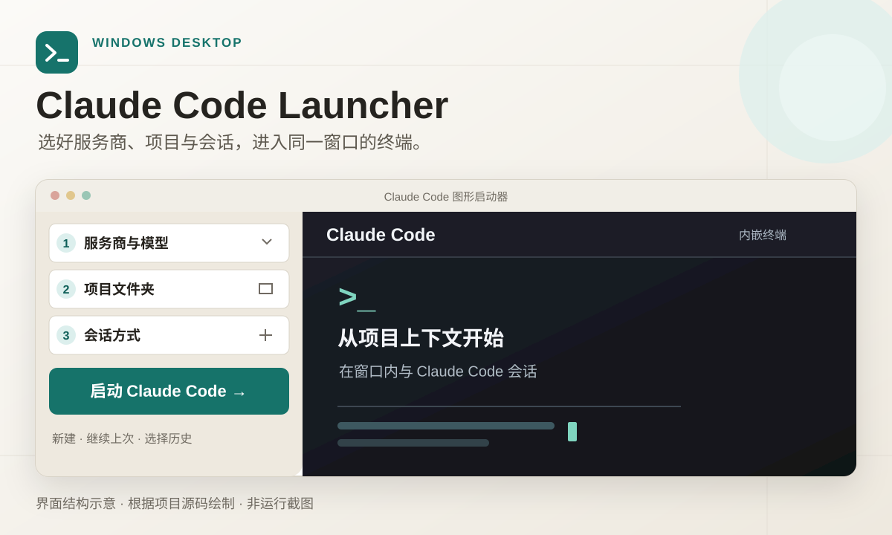

# Claude Code Launcher

**在 Windows 桌面集中选择服务商、模型、项目文件夹和会话，然后在同一窗口的终端使用 Claude Code。** 界面面向中文用户；API Key 从系统环境变量读取。



*根据仓库内的界面代码绘制的结构示意，非运行截图。*

## 从选择到启动

1. **选择服务商与模型**：使用 Mimo、DeepSeek，或在“服务商管理”中添加 Anthropic 兼容接口。
2. **选择项目文件夹**：从本机选择目录，或使用最近项目。
3. **选择会话方式**：新建对话、继续上次对话，或选择历史会话。
4. **在窗口内工作**：启动后使用内嵌终端；可停止、重启或清空终端显示。

窗口最小宽度会按 100 列终端动态计算。

## 安装与首次启动

需要 **Windows**、**Node.js 18 或更高版本**、已安装的 **Claude Code** 和 **Git Bash**。启动器当前使用以下默认路径：

| 程序 | 默认路径 |
| --- | --- |
| Claude Code | `D:\ClaudeCode\claude.cmd` |
| Git Bash | `D:\Git\bin\bash.exe` |

如果安装位置不同，请先在 [`src/main.js`](src/main.js) 中修改 `claudeCmd` 和 `gitBashPath`，再运行：

```powershell
npm install
npm start
```

启动后选择服务商、模型和项目文件夹，再选择会话方式并点击“启动 Claude Code”。

## API Key 与本地配置

启动器默认从系统环境变量读取 `MIMO_API_KEY` 和 `DEEPSEEK_API_KEY`。在 Windows 中设置的示例：

```powershell
setx MIMO_API_KEY "你的 Mimo API Key"
setx DEEPSEEK_API_KEY "你的 DeepSeek API Key"
```

设置后重新打开启动器。真实 API Key 请保存在系统环境变量中；服务商配置只填写**环境变量名**，不要填写密钥值。

| 文件 | 用途 |
| --- | --- |
| [`config/providers.json`](config/providers.json) | 服务商配置 |
| `config/settings.json` | 本机偏好与项目路径；已被 `.gitignore` 忽略，不建议上传 |
| [`config/settings.example.json`](config/settings.example.json) | 偏好配置示例 |

### 添加自定义服务商

在“服务商管理”中填写名称、Anthropic 兼容接口地址、认证方式（`ANTHROPIC_API_KEY` 或 `ANTHROPIC_AUTH_TOKEN`）、密钥环境变量名、模型列表和默认模型。界面也提供“测试连接”。

## 开发与检查

```powershell
npm start
npm run smoke
npm audit --omit=dev
```

`npm run smoke` 检查所需文件、JavaScript 语法和依赖；它不验证 Windows 上的实际启动流程。

## 许可证

[MIT](LICENSE)
